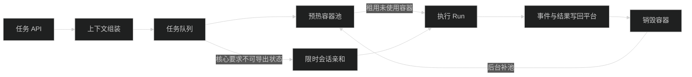
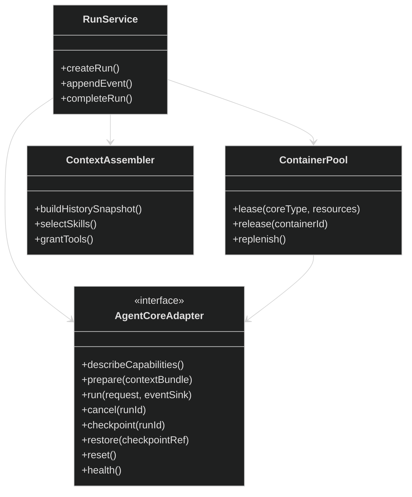

# Agent Core 状态依赖与容器绑定实验报告

更新时间：2026-07-22

> 后续决策更新：首期采用“顶层 Session 绑定容器”。同一 Session 内 Run 串行排队，不同 Session 可以并行。暂不实现 Core 原生续接与“续接/重建”策略选择；容器失效后由平台创建新容器，并从平台权威数据完成初始化恢复。本文实验结论保留为该决策的技术依据，不再代表首期绑定策略。

## 1. 对齐后的需求

平台部署在服务器，统一管理用户、树形会话、消息、工作区、Skills、MCP、外挂程序和配置。Agent Core 只负责推理、规划与工具调用，可替换且不拥有业务数据库。待确认的问题是：容器应绑定单次任务，还是绑定整个会话。

## 2. 名词解释

- **Run（任务运行）**：用户发送一次消息后，从开始到成功、失败或取消的一次执行。
- **预热容器**：已经启动并完成依赖加载、正在等待任务的容器，可减少用户等待时间。
- **租约**：调度器在有限时间内把一个容器分配给某个 Run；任务结束即归还或销毁。
- **会话亲和**：同一会话后续任务尽量回到同一容器，也称“粘性会话”。
- **Checkpoint（检查点）**：可保存并恢复的运行状态，例如对话历史、任务列表或工作区快照。
- **权威数据**：系统发生冲突时最终可信的数据。本方案中平台数据库是权威数据，Core 自带会话文件只能是缓存。
- **Context Bundle（上下文包）**：平台发给 Core 的本次任务输入，包含选定历史、摘要、Skills 清单、工具权限和工作区引用。

## 3. 实验方法

1. 直接调用 Trae Agent 0.1.0 源码，在同一个 Agent 对象中连续创建两个任务，检查第二任务是否保留第一任务标记。
2. 替换实际模型调用为确定性测试桩，只统计每个任务的 MCP 初始化、执行和清理次数。
3. 分别测量 Trae Agent 对象创建和 Trae CLI 新进程启动。
4. 使用 Docker Desktop 4.83.0、Engine 29.6.2 和 `python:3.12-slim`，比较新容器执行与常驻容器内执行。
5. 构造不同规模的历史、Skills 和工具清单，测量序列化体积并粗略估算 Token。
6. 核验 Codex、Claude Code、Gemini CLI、Aider、OpenHands 和 Microsoft Agent Framework 的官方能力说明。

## 4. 实验结果

### 4.1 Trae 状态行为

| 项目 | 结果 |
|---|---:|
| 同一 Agent 对象是否复用 | 是 |
| 第二任务消息数 | 2（系统消息 + 当前任务） |
| 第一任务标记是否保留 | 否 |
| 两任务 MCP 初始化次数 | 2 |
| 两任务 MCP 清理次数 | 2 |
| Agent 对象创建中位数 | 659 ms |
| CLI 新进程启动中位数 | 2,886 ms |

Trae 的 `interactive` 模式虽然复用 Agent 对象，但每次 `new_task()` 都重新建立消息列表；任务结束还会关闭工具和 MCP。因此，对 Trae 而言，“常驻交互进程”主要节省进程和对象初始化，并不自动提供跨任务对话记忆。

源码证据：[`cli.py`](../../../.tools/trae-agent-src/trae_agent/cli.py) 复用 Agent；[`trae_agent.py`](../../../.tools/trae-agent-src/trae_agent/agent/trae_agent.py) 在 `new_task()` 重置消息；[`base_agent.py`](../../../.tools/trae-agent-src/trae_agent/agent/base_agent.py) 在任务后关闭工具和 MCP。

### 4.2 Docker 成本

| 项目 | 样本 | 中位数 | P95 |
|---|---:|---:|---:|
| 每任务新建容器并执行 | 10 | 753 ms | 820 ms |
| 常驻容器内执行 | 10 | 224 ms | 258 ms |
| 顺序扩容到 10 个容器 | - | 5,035 ms | - |

常驻容器可减少约 529 ms，但重复使用同一容器会留下文件、进程或凭据，存在跨用户污染风险。更合适的做法是预先创建“尚未执行过任务”的容器，任务结束后销毁，并在后台补充新容器。

### 4.3 上下文切换成本

序列化耗时始终低于 2 ms，真正成本来自发给模型的 Token，而不是 Python 组装 JSON。

| 场景 | 粗略 Token |
|---|---:|
| 50 轮历史 + 20 工具 | 11,187 |
| 再加 50 个 Skill 清单 | 14,307 |
| 改为携带 50 份完整 Skill 源文件 | 26,105 |
| 100 轮全历史 + 50 份完整 Skill + 100 工具 | 42,068 |
| 旧历史摘要 + 最近 5 轮 + 50 Skill 清单 + 20 工具 | 5,869 |

这里的 Token 是“字符数除以 4”的粗略值，只用于方案横向比较，不能作为账单数据。结果表明：平台重建上下文可行，但不能把所有历史、Skill 源文件和工具 Schema 全量塞给模型。

### 4.4 其他核心

| Core | 已核验的状态方式 | 对平台的含义 |
|---|---|---|
| Codex CLI 0.145 | 支持 `exec --ephemeral`，也支持按 session ID `exec resume` | 可无状态运行；原生 session 可作优化缓存 |
| Claude Code | 支持新会话、continue、resume、session ID 和本地 transcript | 会话可恢复，但状态文件不应成为平台权威数据 |
| Gemini CLI | Checkpoint 保存历史与工具调用，也支持恢复项目快照 | Checkpoint 可导入平台对象存储 |
| Aider | 聊天历史文件可选恢复，超限后会摘要 | 适合平台传入历史文件或摘要 |
| OpenHands | Agent server 与运行环境分离，可在 Docker/VM/企业环境运行 | 证明控制面和执行面分离是成熟方向 |
| Microsoft Agent Framework | 支持 A2A、Durable Task、Durable Workflow | 长任务应依赖持久化编排，而非永久占用容器 |

参考：

- Claude Code CLI：<https://code.claude.com/docs/en/cli-reference>
- Gemini Checkpoint：<https://www.geminicli.com/docs/cli/checkpointing>
- Aider 配置：<https://aider.chat/docs/config/options.html>
- OpenHands：<https://github.com/All-Hands-AI/OpenHands>
- Microsoft Agent Framework：<https://github.com/microsoft/agent-framework>

## 5. 结论

采用 **Run 级容器租约 + 预热容器池 + 可选会话亲和**。

默认情况下，一个会话不永久占有容器。会话历史、工作区、Skills 和工具授权均由平台恢复。只有以下能力确实需要活进程时，才启用会话亲和：

1. 未完成的后台子进程。
2. 无法导出状态的浏览器或终端交互。
3. Core 明确声明只能通过原生 session ID 续接。
4. 正在执行且不可安全中断的长任务。

会话亲和必须配置 TTL（最长保留时间）、空闲超时、容器上限和强制检查点；达到上限后排队，不能偷偷降级到另一容器。

## 6. 建议接口

`describeCapabilities()` 必须声明：是否支持无状态运行、是否支持恢复、状态能否导出、是否要求会话亲和、是否原生支持 Skills/MCP、支持哪些事件类型。平台据此调度，不根据 Core 名称写死逻辑。

## 7. 上下文策略

1. 历史采用“旧消息摘要 + 最近消息 + 当前树形父链关键节点”。
2. 默认只传 Skill 的名称、说明、版本和内容哈希；选中后才挂载或读取完整源文件。
3. 只暴露当前任务被授权的工具，避免把所有 MCP 工具 Schema 发给模型。
4. 工作区通过外部卷或快照恢复，不把文件内容全部放入 Prompt。
5. 每个 Run 保存 Context Snapshot，便于审计和重放。
6. Core 原生 session ID 与 checkpoint 由平台加密保存，但仅作为加速缓存；丢失后必须能从平台数据重建。

## 8. 真实模型验证（2026-07-24）

使用 Trae CLI 0.1.0，通过 OpenAI-compatible provider 连接 Qwen 3.6 Plus，验证了真实模型成功路径。API Key 仅通过当前进程环境变量注入，未写入配置文件；运行配置使用 YAML。

| 项目 | 结果 |
|---|---:|
| Workspace 文件创建 | 通过 |
| 文件内容校验 | `REAL-TRAE-QWEN-20260724`，通过 |
| Trae 完成状态 | 通过 |
| 执行步数 | 5 |
| trajectory 保存 | `results/real-trae-success-6steps.json` |
| 端到端耗时 | 约 28.9 秒 |

第一次使用 3 步上限的运行也成功写入并校验了文件，但因未在步数上限内调用`task_done`而被标记为超出步数；这说明步数配置会影响任务终态，不能把文件副作用单独当作 Core 成功。

本次只验证真实成功路径，尚未验证真实 Trae 的用户提问、30 分钟暂停、跨容器检查点恢复、工具审批和 Docker 全链路。

## 9. 限制

本报告不记录或持久化模型 API Key。真实模型的三组正确率和实际 Token 账单对照尚未完成；后续实验必须继续通过进程环境变量注入凭据。此前环境中的 Anthropic Key 已过期，返回 403；该结果不计入有效模型实验。

原始结果位于 [`results`](results/)；实验脚本会清理所有 `agent-state-lab-*` 临时容器。
