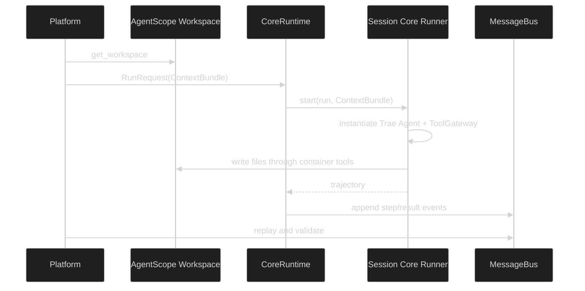
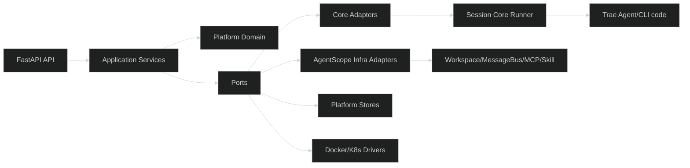
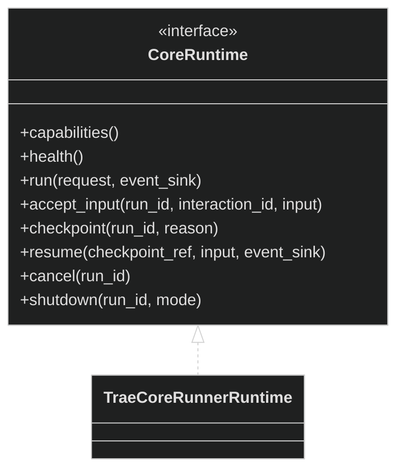
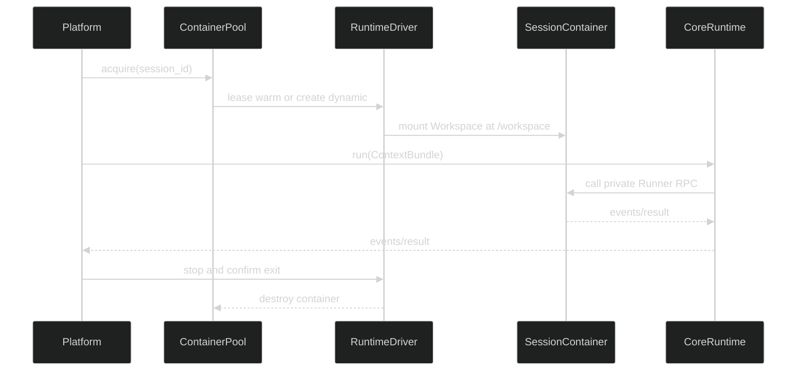

# 已确认事项

更新时间：2026-07-24

1. 产品首期是部署在服务器上的 Agent 后端，不建设 Dify 式低代码编排平台。
2. 产品采用 API-first 的无头标准层，并提供必要的管理控制台；垂直领域自行开发业务 UI。
3. 平台统一管理用户、树形会话、消息、工作区、配置、Skills 源文件、MCP 与外挂服务程序。
4. Agent Core 仅负责推理、规划与工具调用逻辑，可独立部署和替换，不拥有独立业务数据库。
5. Agent Core 不直连平台数据库；平台通过标准协议传入上下文，Core 通过标准协议返回事件与结果。
6. 运行资源采用常驻预热容器池，Session 首个执行过程到来时租用容器；容器不足时动态扩容，达到上限后执行过程排队。
7. 容器绑定范围已确定为顶层 `Session`；同一Session同时最多一个活动容器租约，当前执行过程及其`WAITING_INPUT`等待阶段复用该容器，Session内其他执行过程排队。当前过程正常结束或等待超时安全暂停后容器销毁，后续过程按平台权威数据创建新容器，不依赖Core原生续接。
8. 允许安装 Docker 进行实验；安装目录要求为 `E:\Docker`。
9. 容器绑定范围确定为顶层 `Session`，不是单个 Conversation 节点；同一会话树在同一活动执行期间共享一个容器，容器销毁后由后续执行过程重新创建并挂载同一Workspace。
10. 首期不实现 Core 原生续接与“续接/重建”策略选择。Session 容器失效后，平台创建新容器，并使用平台管理的会话、Skills、工具配置和工作区数据完成初始化恢复。
11. 同一顶层 Session 内一次只执行一个Conversation执行过程，其余请求进入该 Session 的队列；不同 Session 可以并行执行。
12. Session 容器采用懒创建：创建 Session 时只保存数据，首个Conversation执行过程到来时才创建并绑定容器。Conversation正常完成、失败或取消后停止并销毁容器，不把执行过的脏容器放回预热池；后续执行过程创建新容器并从平台权威数据初始化。正在执行的容器不得回收；达到容器上限后新Session排队。
13. Conversation执行进入等待用户反馈的`WAITING_INPUT`状态后开始计算30分钟空闲超时，工具审批和Core向用户提问等交互统一适用。用户在超时前反馈则继续使用当前容器；超时后平台建立安全检查点、停止并销毁容器，状态转为`PAUSED`。用户暂时离开属于正常暂停和资源优化，不属于失败。该值由全局配置管理，后续可扩展为组织级覆盖。
14. 容器健康检查分为 Docker 退出/OOM等事件、Core `/live` 存活检查、`/ready` 接单检查和执行中独立监督心跳。启动宽限期为 30 秒；连续 3 次检查失败后进入疑似失效状态。
15. “执行中失效”指Conversation执行过程处于`RUNNING`时发生容器退出、OOM、宿主机或Docker重启、Core崩溃/死锁、Agent子进程退出或工作区失联。LLM响应慢但独立监督心跳正常时不得判定失效。
16. Session 数据层面只能存在一个当前容器租约，并使用递增 `lease_epoch` 区分新旧实例。旧容器未确认停止时，不允许新容器挂载同一可写工作区；Session 进入暂停恢复状态，确认旧容器停止后才能重建。
17. 平台通过统一 `RuntimeDriver` 管理容器。开发和首期验证实现 Docker Driver；生产分布式部署实现 Kubernetes Driver。平台不自研跨宿主机容器调度器。
18. Workspace 与 Session 采用 1:N 关系：一个 Workspace 可以绑定多个 Session，但每个 Session 必须且只能绑定一个 Workspace，`sessions.workspace_id` 在 Session 创建后永久不可修改。需要操作其他 Workspace 时必须新建 Session。同一 Workspace 同一时刻只允许一个 Session 持有可写租约；接手时先停止并确认旧 Session 容器退出，再递增租约代次并为新 Session 容器挂载该 Workspace，未取得租约的 Session 等待。
19. Workspace 由平台作为独立持久数据管理，在创建 Session 容器时统一挂载到 `/workspace`，并向 Agent Core 传入固定 `project_path=/workspace`。Core 使用普通文件、Shell 和 Git 操作，无需感知宿主存储路径；容器重建后重新挂载同一 Workspace。宿主工具、服务和凭据不属于 Workspace，分别通过预构建环境镜像、环境变量、Sidecar 或 MCP 提供。
20. 每个Conversation执行过程固定使用其所属Session绑定的Workspace，不接收`active_workspace_id`，也不支持运行时切换Workspace。Session容器创建时只挂载该Workspace；跨仓库任务首期通过在同一Workspace内放置多个仓库实现。
21. Workspace 采用三层数据模型：平台数据库保存归属、配额、存储引用、租约和版本元数据；独立持久文件系统保存 Agent 实时操作的代码、PPT、PDF 等任意文件，并挂载为 `/workspace`；对象存储保存不可修改的历史版本、备份和恢复点，不直接作为 Agent 工作文件系统。Git 仅作为代码型 Workspace 的可选能力。存储通过 `WorkspaceStorageDriver` 抽象；开发环境使用本地目录，Kubernetes 生产环境默认每个 Workspace 使用独立 PVC，同时保留共享文件系统 Driver 的扩展能力。
22. Workspace版本的目标方案采用Python `VersionService`编排、PostgreSQL保存版本元数据、独立Restic Worker执行增量去重和加密快照、MinIO/S3保存快照数据；不由平台自研文件分块算法。该方案不进入首期交付，首期只保留`WorkspaceStorageDriver`的Port和假实现。Kubernetes VolumeSnapshot仅作为后续可选加速能力。版本默认纳入`/workspace`下全部文件，不按扩展名推断；平台强制排除运行时目录、缓存和密钥，环境模板通过`ephemeral_paths`声明额外临时路径，Workspace可通过`.workspaceignore`增加排除规则，并在创建版本前提供纳入/排除预览。PPT、PDF等二进制文件支持版本化和恢复，但不自动合并。
23. Session容器停止采用分级策略：先进入排空状态，禁止接收新的Conversation执行过程；普通快照等待当前执行过程自然结束，等待超时则本次快照失败，不强制中断执行过程；容器回收或管理员强制接手时，先发送`SIGTERM`请求优雅退出，宽限期后仍未退出才发送`SIGKILL`。任何场景都必须由RuntimeDriver确认旧容器已经退出或删除后，才能释放Workspace写租约、创建一致性快照或允许新容器接手。执行过程等待用户反馈达到30分钟后，平台保存交互检查点并自动挂起；容器确认停止后释放租约，用户回复、批准或拒绝时自动重建并恢复，不要求额外交互。
24. 将 AgentScope 纳入技术方案，采用保留官方 Git 历史和上游同步能力的企业受控 Fork；不采用 AgentScope Fork 与平台双仓库，而是在同一 Fork 仓库内直接改造并扩展。
25. 单仓库仍保持模块分层：AgentScope Fork 只复用和改造 Workspace、MessageBus、MCP、Skill、沙箱等外围基础设施，绝不使用其内置 Agent、Harness、Agent 循环、内置工具执行和内置模型调用；平台 Domain 负责用户、组织、Session 树、Conversation、Workspace 和Conversation执行字段等业务规则；Platform Service 负责调度、租约、恢复、配置、ContextBundle、Skills/MCP 授权、统一ToolGateway和事件；Infrastructure 负责 PostgreSQL、Redis、对象存储和 Docker/Kubernetes；API 层提供通用接口。
26. 模块依赖保持单向：平台 API 通过 Application Service 和 `CoreRuntime` 运行时网关调用外部 Agent Core（首期 Trae CLI）；Agent Core 和 AgentScope 基础设施适配器均不得反向直接读取平台业务数据库。AgentScope Fork 中保留的内置 Agent 源码不得被导入或实例化。
27. 架构决策更新：AgentScope 内置 `Agent` 与 Harness 永不参与正式运行；Agent Core 必须是可独立运行、独立版本化的外部实现，例如 Trae CLI 或改造后的其他 Agent 产品。平台通过统一 `CoreRuntime` 协议选择并调用 Core，不把外部 Core 包装成 AgentScope `Agent` 子类。本项覆盖第 25 项中“由改造后的 AgentScope 模块负责 Harness、Agent 循环”的表述。
28. 迁移期间暂时保留 AgentScope 内置 `Agent` 源码，但运行入口不得引用或实例化它；先通过实验和契约测试解除 Workspace、消息总线、存储、Skills/MCP 等外围设施对内置 Agent 的依赖，确认无运行引用后再决定物理删除范围。
29. 实验验证（2026-07-24）：AgentScope 2.0.5 的 `LocalWorkspaceManager`、`InMemoryMessageBus` 可与 Trae CLI 0.1.0 独立进程对接；真实模型已在实验 Workspace 创建标记文件，最终结果与 6 条运行/步骤事件写入 MessageBus，事件可重复读取，运行期未加载 `agentscope.agent`。失败、取消、轨迹缺失契约测试 4/4 通过。实验未验证 Docker、Skills/MCP 全链路。
30. 已验证的真实 Trae Smoke Test 路径为：平台创建/获取 Workspace -> `CoreRuntime` 组装工作目录、Trae 配置和受控环境变量 -> 启动 Trae CLI 子进程 -> Trae 写入 Workspace 并生成 trajectory -> Runtime 将步骤/结果事件追加到 MessageBus -> 平台读取事件并校验结果。该路径仅证明真实 Core 的普通运行能力；首期正式审批、用户输入暂停和跨容器恢复必须通过 Session 容器内的 `core_runner` 完成。Trae 0.1.0 配置文件必须使用 `.yaml` 扩展名；API Key 仅注入进程环境，不写入配置文件。
31. 真实 Trae 工具审批实验已跑通：`APPROVE_ONCE` 在副作用前产生审批并在批准后成功创建文件；`REJECT` 同时拦截文件编辑和 bash 回退，目标文件不存在。证据为 `.dev/lab/tool-approval-experiment/real-trae-approval-approve_once.json` 和 `real-trae-approval-reject.json`；该结果支持以 `_tool_caller` 作为统一 ToolGateway 注入边界。
32. 真实跨进程暂停/恢复实验已跑通：进程 A 在工具副作用前创建检查点并退出，进程 B 创建新的 Trae 实例，使用完整 `ContextBundle` 恢复，工具只执行一次并完成任务。证据为 `.dev/lab/tool-approval-experiment/real-trae-checkpoint-resume-result.json`；仅保存 `ToolCall`/`ToolResult` 不足以恢复。
33. 确定性检查点契约实验已通过跨进程恢复、无重复副作用和上下文哈希篡改拒绝；因此恢复必须校验完整 Context Bundle、租约代次和工具参数哈希。
34. Docker 基础运行时实验已跑通：Docker Desktop 29.6.2 支持 Workspace 可写挂载、`session_id/workspace_id/lease_epoch` 容器标签、SIGTERM 优雅退出和 SIGKILL 超时退出；相关实验容器已清理。
35. Trae 自带 `--docker-image` 模式在当前 Windows 环境因 Unix `rm`、路径和缺失 `edit_tool_cli.py` 问题失败，因此不作为首期平台 `RuntimeDriver` 依据；平台改用自有 Session 镜像和容器内 `core_runner`。



## 11. 实施计划（本文件唯一计划）

### 11.1 AgentScope 复用边界

直接复用：

- `WorkspaceBase`、`LocalWorkspace`：工作目录、文件操作和初始化。
- `LocalWorkspaceManager`：开发环境Workspace创建、缓存、关闭和TTL。
- `DockerWorkspaceManager`、`K8sWorkspaceManager`：沙箱和挂载实现；平台外层增加租约与容量控制。
- `MessageBus`、`InMemoryMessageBus`、`RedisMessageBus`：队列、事件日志、锁和注册表语义。
- `MCPClient`：MCP连接配置、启动、关闭和健康状态。
- `Skill`解析、索引和哈希逻辑：读取元数据并复制到Workspace。
- AgentScope日志、遥测和路径安全工具：按依赖审计结果选择性复用。

只做适配：

- `ToolBase`、`LocalBackend`不直接交给Trae；所有内置工具和MCP工具统一经过平台`ToolGateway`进行权限判定、审批挂起和审计，实际调用由 Session 容器内的`ApprovalExecutor`或同 Pod 执行器完成。
- AgentScope MCP配置转换为平台统一定义，再由Trae适配器生成临时`.yaml`或Sidecar连接。
- Skill源码由平台保存和授权，适配器生成清单并只读挂载，不把Skill对象暴露为Core API。
- MessageBus底层操作可以复用，但平台事件使用统一Envelope：`event_id/run_id/seq/type/payload/source`。
- Workspace Manager不负责Session租约、容器上限、租约代次和跨主机调度。

明确不复用：

- `agentscope.agent`、内置Harness、Agent循环、内置模型调用和内置工具执行。
- `agentscope.app._app`、ChatService、Agent Router、Agent Schema、Scheduler、团队/子Agent工具。
- AgentScope `StorageBase`、`AgentRecord`、`AgentState`和其上下文作为平台数据模型。

### 11.2 目标模块分层



- Domain只包含用户、组织、Session、Conversation、Workspace和租约规则，不导入具体厂商库；Run只是Conversation内的执行字段和值对象，不建立独立用户资源或独立Run表。
- Application Service负责Session、Conversation、Conversation执行字段、ContextAssembler、LeaseManager和ContainerPool。
- Ports定义`CoreRuntime`、`WorkspaceProvider`、`EventStore`、`MessageBus`、`RuntimeDriver`、`WorkspaceStorageDriver`、`McpProvider`、`SkillProvider`。
- Adapters实现Trae、AgentScope外围基础设施、Docker/Kubernetes、PostgreSQL、Redis和对象存储。

### 11.3 CoreRuntime契约



`ContextBundle`包含当前任务、选定历史、Workspace引用、工具授权、Skill清单和MCP引用。Core只能通过适配器获得输入，不能直连平台数据库。跨容器精确恢复只保证平台主动建立的安全停顿点：等待用户回复或工具审批时，当前没有工具副作用正在执行，平台持久化`checkpoint_id/conversation_id/run_id/last_event_seq/context_bundle/pending_interaction/pending_tool_calls/tool_batch_hash/workspace_ref/workspace_write_lease_epoch/core_type/core_version`。任意崩溃、OOM、宿主机重启或外部中断不要求精确恢复，按`LOST`处理。

首期正式运行入口是 Session 容器内的 `core_runner`：Runner 在容器内实例化 Trae Agent，替换 `_tool_caller` 为平台适配的 `ToolGatewayExecutor`，并通过 `CoreRuntime` 端口接收请求、返回标准事件。bash、文件编辑、Git、MCP 和第三方工具始终在 Session 容器或同 Pod 网络内执行；平台只负责授权、审批、检查点、恢复、租约和事件持久化。原始 `trae-cli run` 仅保留普通运行 Smoke Test，不作为审批、用户输入暂停或跨容器恢复的正式入口。Trae 0.1.0 配置必须使用`.yaml`扩展名，API Key只注入进程环境。

Runner 只在 Session 容器私有网络暴露，平台是唯一调用方。首期采用 HTTP/JSON，后续可替换为 gRPC 而不改变语义：

```text
GET  /live
GET  /ready
POST /runs
POST /runs/{run_id}/input
POST /runs/{run_id}/checkpoint
POST /runs/{run_id}/cancel
GET  /runs/{run_id}/events?after_seq=
```

`POST /runs` 接收 `run_id`、`conversation_id`、`context_bundle`、`workspace_ref`、`tool_policy` 和 `core_version`；Runner 不接收平台数据库连接串，也不保存平台业务数据。Runner 事件统一使用 `schema_version/event_id/run_id/seq/type/payload/source/occurred_at`，至少包括 `run.started`、`message`、`tool.call`、`interaction.requested`、`checkpoint.created`、`tool.result`、`run.completed`、`run.failed` 和 `run.lost`。平台到 Runner 的请求必须携带 `session_id/container_id/lease_epoch/fence_epoch/correlation_id`，过期租约一律拒绝。

### 11.4 容器和Workspace



- Workspace宿主路径对Core不可见，固定注入为`/workspace`。
- 同一Workspace只允许一个可写Session租约；租约不设置自动过期，旧租约未确认停止时禁止新容器挂载。新Session申请已占用Workspace时主动触发占用方状态核查；只有占用方已结束且RuntimeDriver确认其容器已经退出或删除，才允许兜底回收旧租约并递增`fence_epoch`。兜底回收必须产生结构化警告、审计事件和指标；占用方仍健康时新Session继续等待，状态不确定时保留旧租约并禁止接管。
- 常驻池只提供干净预热容器；租给Session后独占。Conversation处于`WAITING_INPUT`时最多保留30分钟，正常完成、失败、取消或等待超时并安全暂停后销毁，不回收脏容器。
- 首期容器安全基线：非`privileged`、非`root`、镜像层只读，仅允许`/workspace`可写挂载；凭据只通过受控环境变量或Secret Provider注入，不允许任意宿主机路径挂载。
- 首期默认允许必要的HTTPS出站访问；更细粒度的网络白名单作为后续安全策略扩展。
- 首期资源配置：最多同时运行2个Session容器，最多排队100个Conversation执行过程；超过队列上限时API返回`429 RESOURCE_EXHAUSTED`。不同Session按全局FIFO获取容器，同一Session内按创建顺序执行。
- 首期容器启动超时为30秒；启动失败写入结构化运行时错误事件并将Conversation执行状态推进为`FAILED`，不自动重试。容器停止先发送`SIGTERM`，宽限期30秒后仍未退出才发送`SIGKILL`；RuntimeDriver确认退出前不得释放Workspace写租约或允许新容器接手。
- RuntimeDriver的启动、停止、删除和检查操作都带有`runtime_operation_id`并具备幂等语义；外部Docker动作不参与数据库分布式事务，平台通过操作事件、状态投影和重试/对账任务记录操作进度。停止超时且无法确认退出时，保留旧租约并发布`container_stop_unconfirmed`反馈，禁止新容器挂载。
- 所有同步API错误使用统一Envelope：`code/message/retryable/operation/correlation_id/details`；异步运行时失败通过Conversation事件、SSE和结构化日志反馈。日志至少包含`correlation_id/conversation_id/session_id/container_id/lease_epoch/runtime_operation_id/event_id`。

### 11.5 上下文和事件

- 平台保存完整事件；ContextAssembler按Conversation父链生成摘要、最近消息、Skill清单和工具授权。
- Trae原始trajectory作为审计附件，适配器转换后写入标准事件。
- Conversation内执行字段状态：`QUEUED -> STARTING -> RUNNING -> WAITING_INPUT -> RUNNING`；等待超时按`WAITING_INPUT -> SUSPENDING -> PAUSED`安全暂停，收到用户回复或审批决定后按`PAUSED -> RESUMING -> STARTING -> RUNNING`恢复，并最终进入`COMPLETED/FAILED/CANCELLED/LOST`。用户等待超时本身不是错误。
- 容器失效时当前执行字段标为`LOST`；重试时由新的执行过程覆盖旧的当前状态，完整动作和消息流仍保存在事件流中，不建立独立Run表或Run资源。
- 首期不做Trae进程原生续接；容器失效或执行终止后，用户后续交互创建新的Conversation执行过程；`PAUSED`状态的审批恢复不创建新的Conversation。
- 执行过程不作为独立用户资源暴露；Conversation保存当前执行状态、结果摘要和流式动作/消息引用，事件Envelope可携带内部执行关联标识用于审计和关联。
- 事件Envelope固定包含`schema_version/event_id/run_id/seq/type/payload/source/occurred_at`；同一Conversation的事件按`seq`单调递增并支持幂等重放。
- PostgreSQL `conversation_events`表是动作、消息、工具调用、审批和结果的权威追加日志；`conversation.run`只保存当前执行状态、待审批信息、结果摘要和`last_seq`投影。InMemory MessageBus只负责进程内通知和唤醒SSE，服务重启后从事件表恢复。
- 首期事件读取同时提供基于`after_seq`的历史查询和SSE实时流；SSE断线后通过`after_seq`继续消费，不保证消息只投递一次。
- 首期`seq`只在单个Conversation内递增并作为SSE游标；Session级事件接口仅聚合多个Conversation事件，不保证跨Conversation的严格全局顺序，暂不维护Session全局序号。
- 首期不建立独立Message表或独立Run表；用户消息、Core消息、工具调用、工具结果、审批和轨迹均作为事件类型写入`conversation_events`，Conversation只保留列表展示和当前状态所需的少量投影字段。
- 事件追加、`conversation.run`投影更新和检查点创建/更新必须在同一PostgreSQL事务中提交；事务提交后才通知InMemory MessageBus和SSE。
- 审批、取消和创建Conversation支持幂等键及`expected_seq`并发校验；相同请求重复提交幂等成功，状态版本已变化时返回冲突。
- `WAITING_INPUT`是持久状态：平台保存待用户回复或待审批的交互、Context Snapshot和交互检查点；用户回复、批准、拒绝或超时后由平台推进状态机。等待达到30分钟后进入`SUSPENDING`，完成检查点持久化并确认容器停止后转为`PAUSED`并释放租约；用户后续反馈自动触发重建和恢复。
- 首期主动停顿点由工具审批或Core向用户提问触发，不提供用户任意手动暂停接口。容器仍运行时为`WAITING_INPUT`；超过30分钟安全暂停后转为`PAUSED`。用户在`PAUSED`状态回复、批准或拒绝后，平台自动创建容器、恢复检查点并继续执行，不要求额外唤醒操作。平台或数据库暂时不可用导致检查点尚未持久化时保持`SUSPENDING`并重试，不把用户等待超时标记为失败；只有Core或容器丢失且无法形成安全停顿点时才转为`LOST`。
- 用户拒绝工具时，平台向Core注入失败的`ToolResult`并恢复执行，由Core自行决定重试、改用其他工具或结束Conversation。
- Trae一次返回多个ToolCall时按批次处理：只要其中任意一个工具需要审批，整批ToolCall在任何工具执行前统一进入审批；用户批准后按原批次策略执行，用户拒绝时整批工具均不执行，并向Core注入对应失败的`ToolResult`。

### 11.6 API草案

- `POST /sessions`：创建Session并固定Workspace。
- `POST /workspaces`：创建Workspace；Workspace与Session分开创建。
- `POST /sessions`请求必须提供`workspace_id`；Session创建后永久固定Workspace，不支持运行时切换。
- `POST /sessions/{session_id}/conversations`：创建树节点并启动一次Conversation执行过程，返回Conversation及当前执行状态，不单独暴露Run资源。
- `GET /conversations/{conversation_id}/events?after_seq=`：按游标读取标准事件。
- `GET /conversations/{conversation_id}/events/stream?after_seq=`：通过SSE实时推送事件；断线后使用游标补偿。
- `GET /sessions/{session_id}/events`：读取Session事件和重放历史。
- `POST /conversations/{conversation_id}/cancel`：请求当前Conversation执行过程取消并推进状态机。
- `POST /conversations/{conversation_id}/approval`：提交工具审批决定，支持批准、拒绝和超时后的恢复触发。
- `POST /conversations/{conversation_id}/input`：提交Core向用户提问所需的反馈；请求携带`interaction_id`、`expected_seq`和`Idempotency-Key`，在`WAITING_INPUT`时直接恢复当前Core，在`PAUSED`时自动触发容器重建和检查点恢复。
- `GET /cores`：返回外部Core能力，不暴露内置Agent。
- 首期API使用单组织部署模型；只提供部署机本地调试账号，不接入正式认证系统。用户身份和资源归属保留，组织级隔离与组织配额暂不实现。
- 根Conversation的`parent_conversation_id`为`null`；子Conversation必须显式提供父节点，不自动推断“最近节点”。
- 创建Workspace、Session和Conversation的请求支持`Idempotency-Key`；相同Key重试返回原资源，不重复创建。
- 取消状态规则固定：`RUNNING`请求Core取消，`WAITING_INPUT`取消当前用户反馈或工具审批等待，`PAUSED`直接标记取消并废弃检查点；终态`COMPLETED/FAILED/CANCELLED/LOST`重复取消幂等成功。

### 11.7 实施顺序

1. 隔离AgentScope入口，确保Workspace/MessageBus导入不加载`agentscope.agent`。
2. 建立平台Domain和EventStore，不迁移`AgentRecord/AgentState`；Conversation执行状态和动作/消息流作为Conversation字段及事件流保存，不建立独立Run表。
3. 定义Ports和统一事件Envelope。
4. 将AgentScope Workspace/MessageBus封装为Adapters，先接Local/InMemory，再接Docker/Redis。
5. 实现ContextAssembler、Session租约、常驻预热池、动态扩容和Workspace挂载。
6. 构建固定版本的 Session 镜像，内置 Trae 源码、依赖和 `core_runner`，并实现私有 Runner RPC（健康检查、运行、输入、检查点、取消和事件读取）。
7. 将平台 `CoreRuntime` Port 接到 Runner RPC；在 `core_runner` 内实例化 Trae Agent，注入统一 `ToolGatewayExecutor`，补充配置、凭据、trajectory、取消和恢复循环。原始 `trae-cli run` 仅保留 Smoke Test。
8. 接入Skills/MCP适配器，先做只读Skill挂载和最小MCP授权测试；所有 bash、文件编辑、Git、MCP 和第三方工具均在 Session 容器或同 Pod 内执行。
9. 实现Conversation级SSE事件流、Conversation执行状态呈现、取消和工具审批/用户输入挂起恢复，移除`builtin`运行选项。
10. 首期使用PostgreSQL、本地Workspace、InMemory EventBus和Docker Driver完成端到端闭环；Redis、MinIO/S3、Restic和Kubernetes作为后续适配器。
11. MCP首期只完成一个受控接入测试，Skills实现授权后的只读挂载；MCP市场、动态安装和复杂授权不纳入首期。
12. Docker/Redis、Skills/MCP和Kubernetes分别通过集成测试后才标记支持。
13. 外围契约稳定后，再评估物理删除内置Agent源码。

### 11.8 验收门槛

- Workspace/MessageBus导入不加载`agentscope.agent`。
- Trae真实运行能写Workspace、产出结果并写入/重放标准事件。
- 真实 Trae 工具审批必须在副作用前产生审批事件；批准后工具只执行一次，拒绝时整批工具均不得产生副作用。
- 进程 A 创建检查点并退出后，进程 B 使用完整 `ContextBundle` 恢复，工具只执行一次；仅保存 `ToolCall`/`ToolResult` 不得视为可恢复。
- 检查点 Context Bundle 哈希、Workspace 写租约代次、工具版本或工具参数哈希不匹配时，恢复必须拒绝并产生结构化事件。
- Trae失败、取消、轨迹缺失均能映射Conversation执行状态。
- 同一Session不会出现双容器或双写租约。
- 容器重建只依赖平台数据、Workspace和配置。
- Conversation的SSE事件流支持断线后按`after_seq`补偿，事件可幂等重放。
- 工具审批或Core用户提问可进入`WAITING_INPUT`，30分钟后自动安全暂停，用户反馈后可重建容器并恢复执行；等待超时不得映射为失败。
- 容器满足非特权、非root、受限挂载和受控凭据注入的安全基线。
- 并发容器、排队上限、FIFO顺序和`429 RESOURCE_EXHAUSTED`行为有集成测试；容器启动/停止超时均能产生结构化事件、HTTP或SSE反馈和关联日志。
- RuntimeDriver操作具备幂等键；停止未确认时不会释放Workspace写租约或允许新容器接手。
- Docker RuntimeDriver 必须区分 SIGTERM 正常退出和 SIGKILL 超时；Trae CLI 自带 Docker 模式不作为首期支持依据。
- Docker/K8s、Redis、Skills和MCP未完成各自集成测试前，不得宣称生产支持。

### 11.9 本轮对齐补充

- 首期实现边界：单机Docker运行，PostgreSQL保存平台数据，本地目录保存Workspace，InMemory EventBus完成事件闭环；生产Kubernetes、Redis和对象存储不进入首期交付。
- 首期保留Workspace版本服务的Port和假实现，完整Restic增量快照、MinIO/S3、版本预览和恢复能力进入后续阶段。
- Skills首期实现授权后的只读挂载；MCP只完成一个受控接入测试，不实现MCP市场、动态安装和复杂授权系统。
- 对外API以Session、Conversation为中心，Run只作为Conversation内的执行状态和事件关联字段。
- 首期必须实现工具审批和Core用户提问、`WAITING_INPUT`、30分钟自动安全暂停、审批/用户输入接口、检查点持久化和容器重建恢复。
- 首期仅启用部署机本地调试账号，账号只允许从部署机访问；暂不接入密码登录、JWT、OIDC、LDAP等正式认证机制。
- 审批接口在`WAITING_INPUT`和`PAUSED`状态都可提交；`APPROVE_ONCE`在`PAUSED`状态自动触发容器重建、检查点恢复和待审批工具执行。
- 审批决定以`approval_id`和`expected_seq`进行幂等及并发校验；相同决定重复提交幂等成功，相反决定或Conversation已结束时返回冲突。
- 身份边界统一称为“组织”：用户是具体登录账户，组织是未来的资源和配额隔离边界；首期只运行一个组织，不实现组织管理和组织切换。
- `conversation.run`只作为当前状态投影，完整动作/消息历史写入`conversation_events`；首期只保证Conversation级`seq`，不实现跨Conversation的Session全局序号。
- 内置工具审批实验已确认Trae所有工具调用可通过`BaseAgent._tool_caller`统一拦截；短时等待保持进程运行，30分钟超时后在工具尚未执行或Core等待用户回复的主动安全停顿点持久化检查点并销毁容器，用户反馈后通过新的CoreRuntime从该检查点恢复。容器任意崩溃或外部操作中断不要求精确恢复，按`LOST`或未完成状态处理。全部问题对齐后必须用确定性假Core和真实Trae分别验证。
- ToolGateway最小接口为`describe_tools/authorize/execute/checkpoint/restore`；所有内置工具和MCP工具必须经过该网关，不使用CLI stdin作为审批协议。
- 首期数据库基线：`users`、`organizations`、`workspaces`、`sessions`、`conversations`、`conversation_events`、`conversation_checkpoints`、`container_leases`、`workspace_write_leases`、`idempotency_keys`和`runtime_operations`；`ContextBundle`、执行状态、ToolCall批次和租约代次作为值对象或投影字段，不单独建表。`conversation_events`使用`UNIQUE(conversation_id, seq)`，事件追加通过锁定Conversation投影行原子递增`last_seq`；每个Session只能有一个活动容器租约，每个Workspace只能有一个活动写租约。`run_id`是执行尝试UUID但不建立独立Run表；`idempotency_keys`持久化`scope/key/request_hash/resource_id/response_payload`，`runtime_operations`持久化容器操作、按需租约核查、状态对账和警告结果。
- ToolGateway采用控制面与执行面分离：平台负责授权、审批、检查点和事件持久化；实际`bash`、文件编辑、Git和MCP工具始终在Session容器内执行。首期允许 Runner 与 Trae Agent 在 Session 容器内同一 Python 进程使用`ApprovalExecutor`，后续可替换为容器内独立执行器与平台 RPC，不改变Core看到的工具接口。
- 审批恢复后必须重新校验Session租约、Workspace写租约、工具版本、授权策略和工具参数哈希，不能只信任历史审批结果。
- ToolGateway首期采用请求/响应接口；工具执行过程的stdout、stderr、进度和结果通过统一事件流上报，不在工具接口内实现流式返回。
- 跨容器恢复只覆盖平台主动建立的安全停顿点：工具审批前或Core等待用户回复时由ToolGateway/CoreRuntime适配器持久化检查点，容器停止后用户反馈从该检查点继续；任意崩溃、OOM、宿主机重启或外部操作中断不要求精确恢复，按`LOST`处理。
